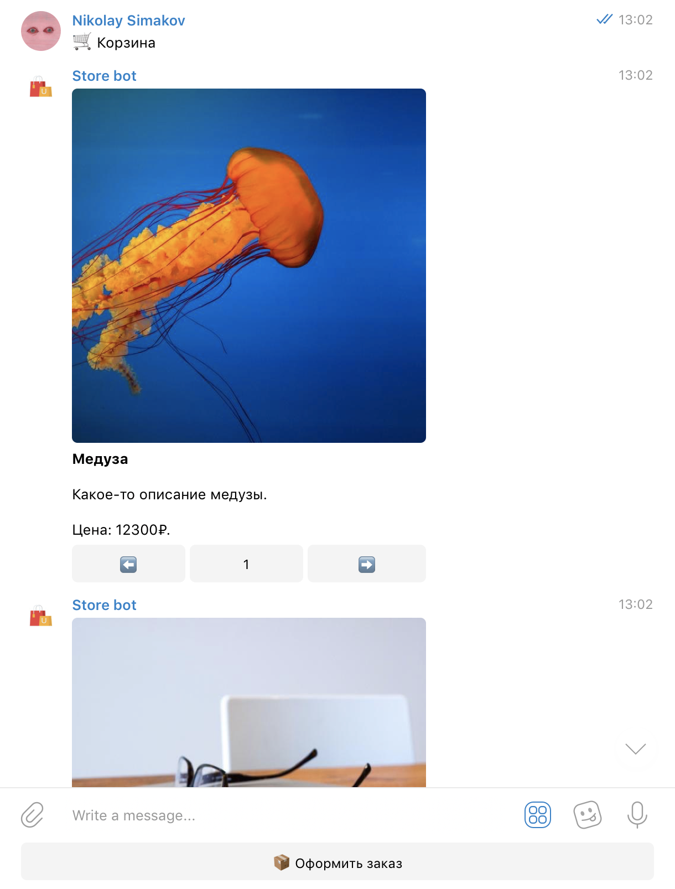
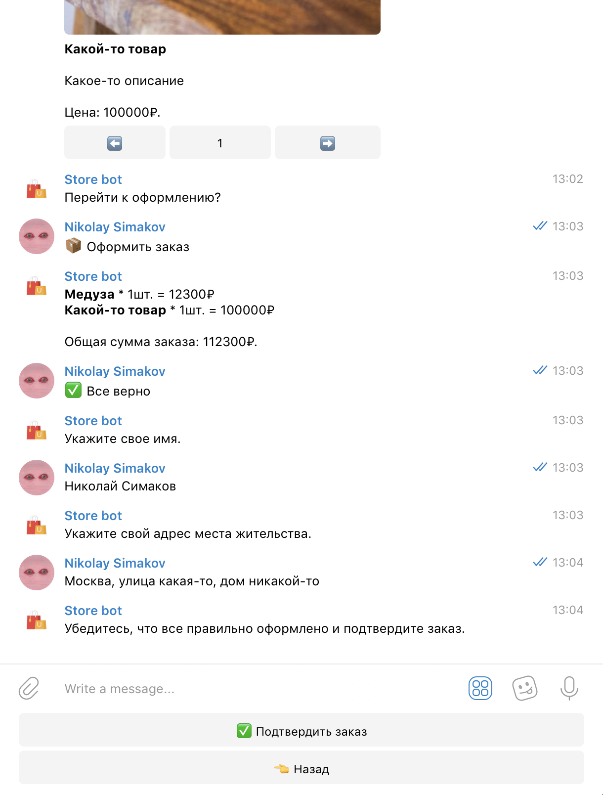
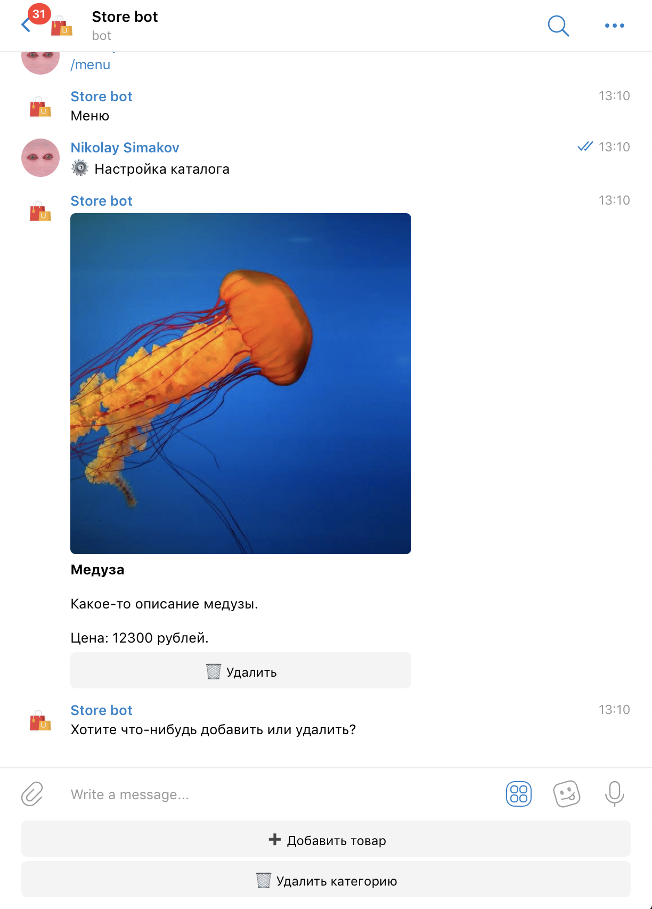
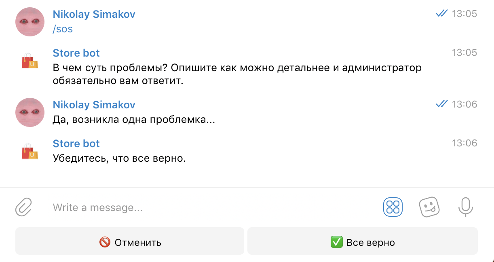

<p align="center">
  <a href="https://t.me/example_store_bot"></a>
</p>

# Shop Bot

A Telegram bot for managing an online shop with product catalog, cart functionality, and order management.

## Features

-   Product catalog with categories
-   Shopping cart functionality
-   Order management
-   Admin panel for product management
-   User support system
-   PostgreSQL database integration

## Setup

### Prerequisites

-   Python 3.7+
-   PostgreSQL database
-   Telegram Bot Token

### Installation

1. Clone the repository:

```bash
git clone <repository-url>
cd Shop-bot-master
```

2. Install dependencies:

```bash
pip install -r requirements.txt
```

3. Set up PostgreSQL database:

```bash
# Create database
createdb shop_bot

# Or using psql
psql -U postgres
CREATE DATABASE shop_bot;
```

4. Configure environment variables:

```bash
cp .env.example .env
# Edit .env file with your configuration
```

5. Update the `.env` file with your settings:

```
BOT_TOKEN=your_bot_token_here
DB_HOST=localhost
DB_NAME=shop_bot
DB_USER=postgres
DB_PASSWORD=your_password_here
DB_PORT=5432
ADMINS=your_telegram_id
```

6. Run the bot:

```bash
python app.py
```

## Database Schema

The bot uses PostgreSQL with the following tables:

-   `products`: Product information
-   `orders`: Customer orders
-   `cart`: Shopping cart items
-   `categories`: Product categories
-   `wallet`: User wallet/balance
-   `questions`: User support questions
-   `users`: User information

## Usage

### For Users

-   Browse products by category
-   Add items to cart
-   Place orders
-   Check delivery status
-   Contact support

### For Admins

-   Add/edit/delete products
-   Manage categories
-   View and process orders
-   Respond to user questions

## License

This project is licensed under the MIT License.

## What can it do?

1. `/start` - needed to start the bot and choose the mode (user/admin).

2. `/menu` - go to the menu.

3. `/sos` - ask the administrator a question.

## Menu

The user menu looks like this:


## Catalog

The catalog consists of products sorted by categories. Users can add items to their cart, and the admin has full control over catalog management (addition/removal).

## Cart

The ordering process looks like this: the user goes to the `🛍️ Catalog`, selects the desired category, chooses products, and clicks the `🛒 Cart` button.



---

Then, after making sure everything is in place, proceed to checkout by clicking `📦 Place Order`.



## Add a Product

To add a product, select a category and click the `➕ Add Product` button. Then, fill out the "name-description-image-price" form and confirm.



## Contacting Administration

To ask the admin a question, simply select the `/sos` command. There is a limit on the number of questions.



## Get started

1. Clone this repository.

2. Create and activate virtual enviroment:

Windows:

```powershell
python -m venv venv
& venv/scripts/activate.ps1
```

UNIX:

```bash
python3 -m venv venv
source venv/scripts/activate
```

3. Install the requirements:

```bash
pip install -r requirements.txt
```

4. Create and populate `.env` file in the root directory. Here are the required keys (_\*_ - always required; _\*\*_ - required only in production):

| Key                                  | Value                                                                                                                                       |
| ------------------------------------ | ------------------------------------------------------------------------------------------------------------------------------------------- |
| BOT*TOKEN (*\*\_)                    | To get bot token, you need create a bot via [BotFather](https://t.me/BotFather/).                                                           |
| PROJECT*NAME (*\*\*\_)               | Name of your project on Heroku (required if you want to deploy bot on Heroku).                                                              |
| WEBHOOK*HOST, WEBHOOK_PATH (*\*\*\_) | Webhook host and path.                                                                                                                      |
| ADMINS (_\*\*_)                      | A comma-separated string of admins IDs (e.g., 000000000,123456789). To get your Telegram ID, use [Get My ID bot](https://t.me/getmyid_bot). |

Example:

```properties
BOT_TOKEN=YOUR_BOT_TOKEN
ADMINS=123456789,000000000
```

5. Run `app.py`:

```bash
python3 app.py
```
